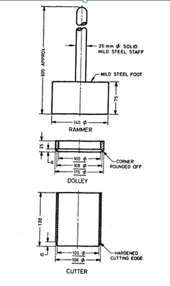

### INTRODUCTION 

 The in-situ density refers to the mass per unit volume of soil in the undisturbed state or compacted soil in-place. The moisture content will vary from time and henc the in-situ density also. So it is required to present the test result in terms of dry density. The relationship which can be established between the dry density with known moisture content is as follows:
Field Density,γ (g/cc) = Weight of soil/Volume of soil

Dry Density, γd (g/cc)   =γ/(1+w)

  
<!-- 

Characteristics curve of different fan.
 

Source: (<a href="https://www.cibsejournal.com/cpd/modules/2011-12/">https://www.cibsejournal.com/cpd/modules/2011-12/
</a>) -->

 

 Core cutter is suitable for soft to medium cohesive soils, in which the cutter can be driven. It is not possible to drive the cutter into hard, boulder or murrum soils. In such a case, other methods are adopted.

Field density is used in finding the stress in the soil due to its overburden pressure. It is needed in estimating the bearing capacity of soil foundation systems, settlement of footings, earth pressures behind the retaining walls and embankments. The stability of natural slopes, dams, embankments and cuts is checked with the help of the density of those soils. It is the density that controls the field compaction of soils. The permeability of soils depends upon their density. The relative density of cohesionless soils is determined by knowing the dry density of soil in natural, loosest and densest states. Void ratio, porosity and degree of saturation also can be calculated using the density of soil.

